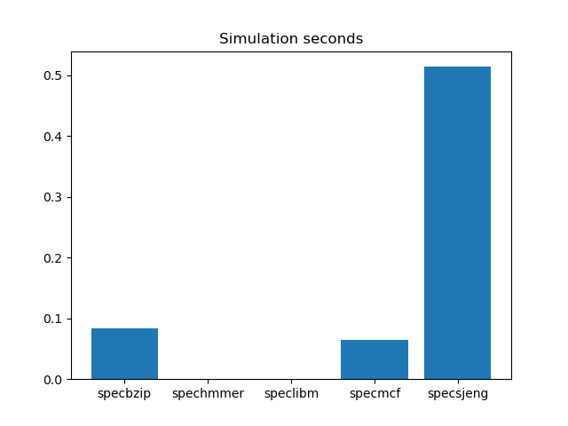
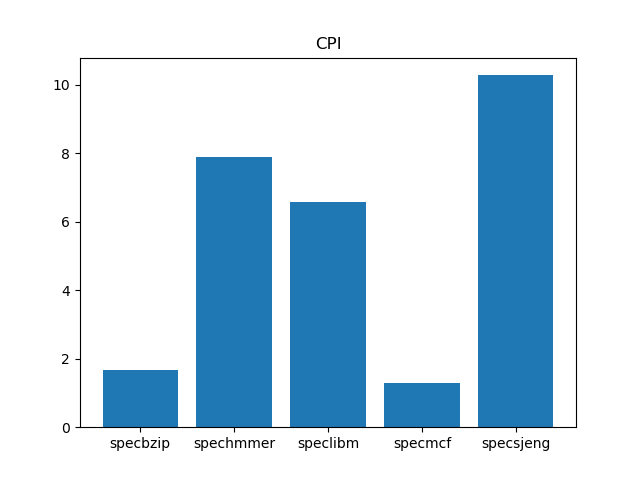
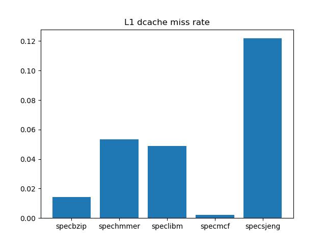
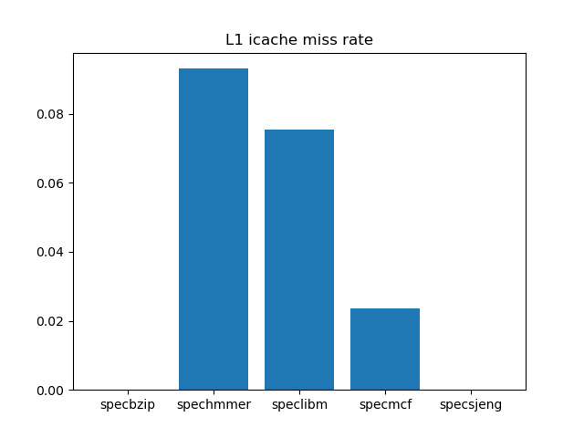
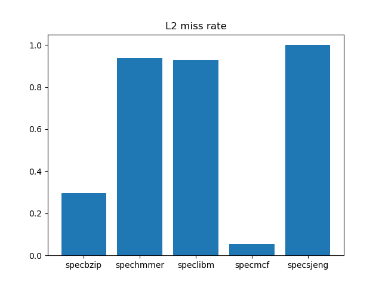

# Advanced-Computer-Architecture-Lab-2

## Second Lab Questions:

Results collected by gem5 running on VirtualBox VM Ubuntu 19.10.
 


### Step 1: Run SPEC CPU2006 benchmarks on gem5

#### Question 1:

We notice in ```se.py```:

```python
from common import Options
```

Therefore, we will look for the simulated CPU's parameters in the ```common/Options.py``` file:

```python
parser.add_option("--l1d_size", type="string", default="64kB")
parser.add_option("--l1i_size", type="string", default="32kB")
parser.add_option("--l2_size", type="string", default="2MB")

parser.add_option("--l1d_assoc", type="int", default=2)
parser.add_option("--l1i_assoc", type="int", default=2)
parser.add_option("--l2_assoc", type="int", default=8)

parser.add_option("--cacheline_size", type="int", default=64)
```

#### Question 2:
```specbzip```:
```
sim_seconds                                    0.083718                       # Number of seconds simulated
system.cpu.cpi                                 1.674353                       # CPI: cycles per instruction
system.cpu.dcache.overall_miss_rate::total     0.014248                       # miss rate for overall accesses
system.cpu.icache.overall_miss_rate::total     0.000077                       # miss rate for overall accesses
system.l2.overall_miss_rate::total             0.295243                       # miss rate for overall accesses
```

```spechmmer```:
```
sim_seconds                                    0.000061                       # Number of seconds simulated
system.cpu.cpi                                 7.876944                       # CPI: cycles per instruction
system.cpu.dcache.overall_miss_rate::total     0.053395                       # miss rate for overall accesses
system.cpu.icache.overall_miss_rate::total     0.093111                       # miss rate for overall accesses
system.l2.overall_miss_rate::total             0.938750                       # miss rate for overall accesses
```

```speclibm```:
```
sim_seconds                                    0.000042                       # Number of seconds simulated
system.cpu.cpi                                 6.586496                       # CPI: cycles per instruction
system.cpu.dcache.overall_miss_rate::total     0.048994                       # miss rate for overall accesses
system.cpu.icache.overall_miss_rate::total     0.075556                       # miss rate for overall accesses
system.l2.overall_miss_rate::total             0.930275                       # miss rate for overall accesses
```

```specmcf```:
```
sim_seconds                                    0.064937                       # Number of seconds simulated
system.cpu.cpi                                 1.298734                       # CPI: cycles per instruction
system.cpu.dcache.overall_miss_rate::total     0.002079                       # miss rate for overall accesses
system.cpu.icache.overall_miss_rate::total     0.023610                       # miss rate for overall accesses
system.l2.overall_miss_rate::total             0.055082                       # miss rate for overall accesses
```

```specsjeng```:
```
sim_seconds                                    0.513811                       # Number of seconds simulated
system.cpu.cpi                                10.276223                       # CPI: cycles per instruction
system.cpu.dcache.overall_miss_rate::total     0.121831                       # miss rate for overall accesses
system.cpu.icache.overall_miss_rate::total     0.000020                       # miss rate for overall accesses
system.l2.overall_miss_rate::total             0.999972                       # miss rate for overall accesses
```







#### Question 3:

Comparing the two ```stats.txt``` files, we notice that the ```system.clk_domain.clock``` parameter remains constant at 1000, while the ```system.cpu_clk_domain.clock``` parameter changes as we change the CPU clock. This means that the system clock frequency remains constant at 1 GHz, while the CPU clock frequency (which will affect the time that our instructions will take to be executed) changes. If we were to add another CPU, its clock frequency would obviously be set at 2 GHz.

The following values show the different simulation times for 1 GHz and 2 GHz:
```
            1 GHz        2 GHz:

specbzip    0.160412     0.083718
spechmmer   0.000123     0.000061
speclibm    0.000067     0.000042
specmcf     0.127847     0.064937
specsjeng   0.705441     0.513811
```
The above prove that, in the cases of ```specbzip```, ```spechmmer``` and ```specmcf``` we have almost perfect scaling, while in the cases of ```speclibm``` and ```specsjeng``` simulation time doesn't scale as well with the additional CPU clock frequency.
